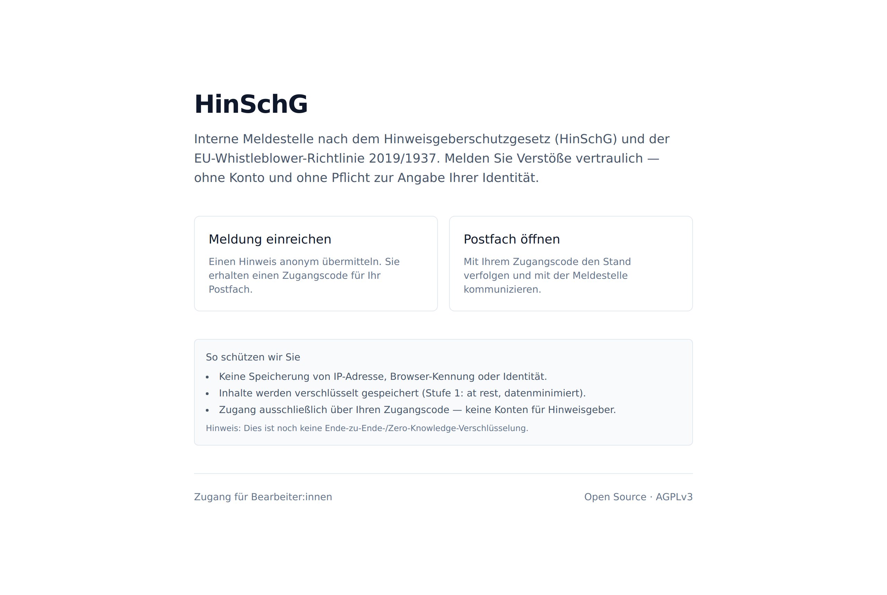
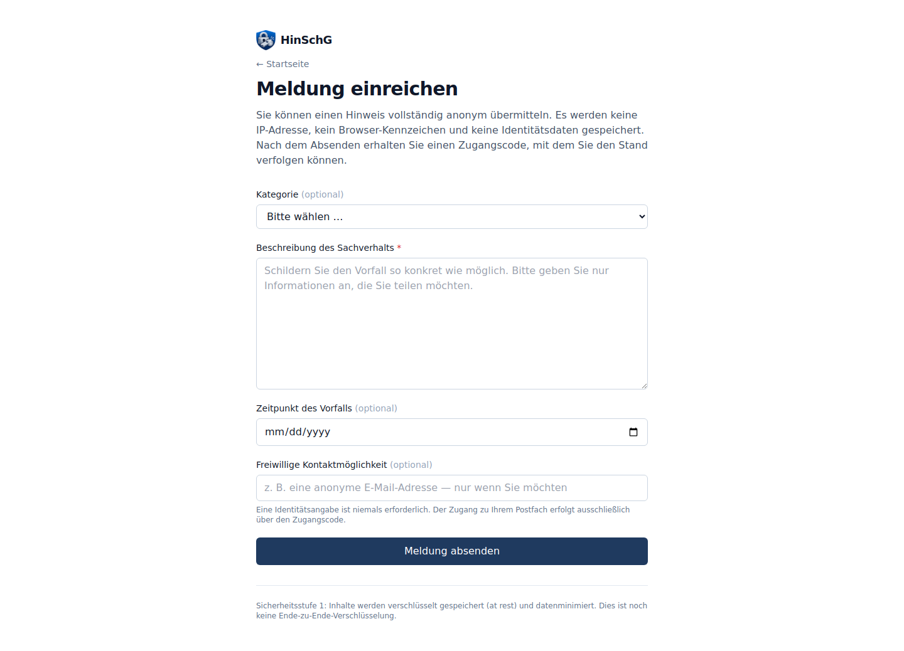
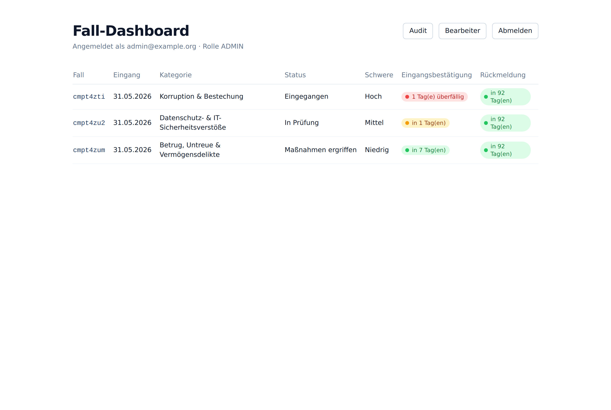
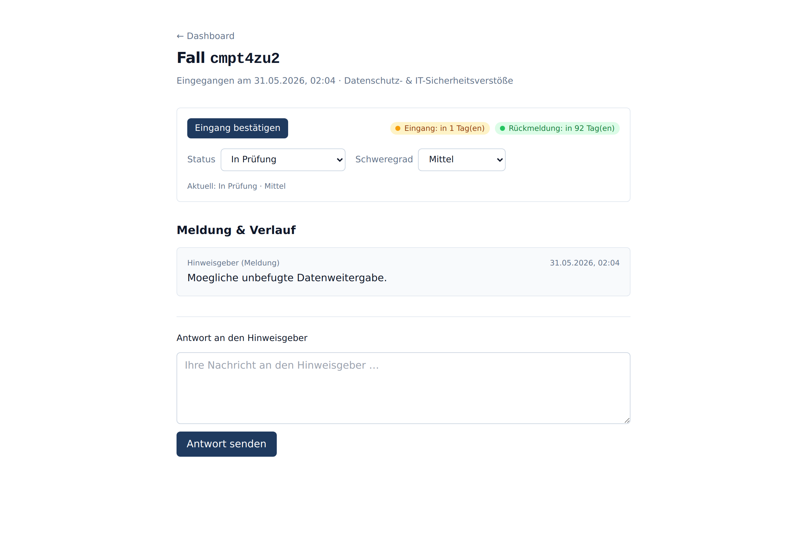
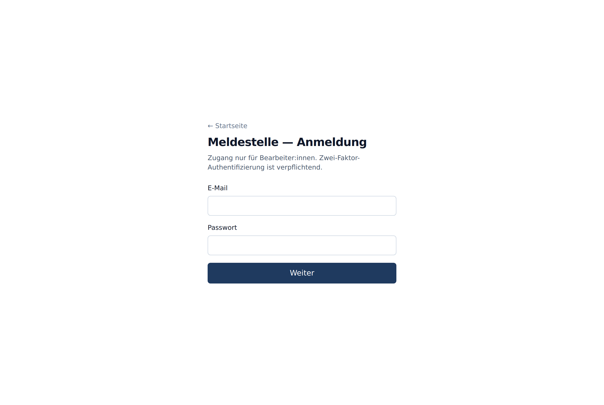
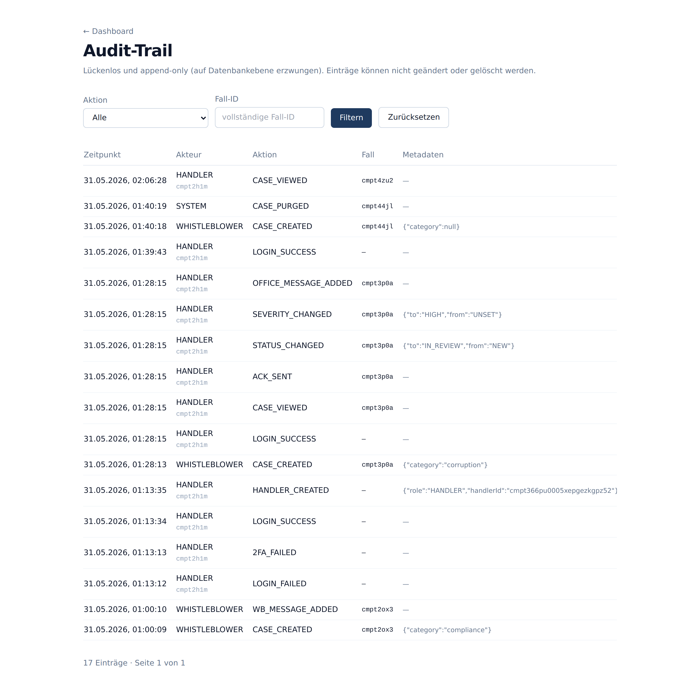

<div align="center">


# HinSchG

**Die quelloffene Hinweisgeber- & Compliance-Plattform für das deutsche Hinweisgeberschutzgesetz**

Anonyme interne Meldestelle nach **HinSchG** und **EU-Richtlinie 2019/1937** — datenminimiert, verschlüsselt und in unter 10 Minuten selbst gehostet.

[](./LICENSE)
[](https://www.gesetze-im-internet.de/hinschg/)
[](https://nextjs.org/)
[](https://www.typescriptlang.org/)
[](https://www.postgresql.org/)
[](#qualität--sicherheit)

[Funktionen](#funktionen) · [Einblicke](#einblicke) · [Schnellstart](#schnellstart) · [Sicherheit](#sicherheit--datenschutz) · [Compliance](#hinschg-compliance) · [Self-Hosting](./docs/SELFHOSTING.md)

</div>

---

## Warum HinSchG?

Seit dem **Hinweisgeberschutzgesetz (HinSchG, 2023)** müssen Unternehmen und Behörden ab **50 Beschäftigten** eine interne Meldestelle betreiben, die Hinweise **vertraulich** entgegennimmt, **fristgerecht** bearbeitet und **anonyme** Meldungen ermöglicht. Verstöße können mit **Bußgeldern bis 50.000 €** geahndet werden.

**HinSchG** stellt genau diese Meldestelle bereit — als selbst gehostete Open-Source-Lösung, die Sie vollständig kontrollieren. Kein SaaS-Abo, keine Datenweitergabe an Dritte, voller Quellcode.

> **Leitprinzip:** Der Betreiber ist Teil des Bedrohungsmodells. Was nicht erhoben wird, kann nicht geleakt, gehackt oder herausverlangt werden. Deshalb speichert HinSchG **keine** IP-Adressen, **keine** Browser-Kennungen und **keine** Pflicht-Identität der Hinweisgeber:innen.

---

## Einblicke

<table>
  <tr>
    <td width="50%"><b>Startseite</b> — klare Wege für Hinweisgeber:innen</td>
    <td width="50%"><b>Meldung einreichen</b> — anonym, ohne Konto</td>
  </tr>
  <tr>
    <td></td>
    <td></td>
  </tr>
  <tr>
    <td><b>Fall-Dashboard</b> — mit Fristen-Ampel (7 Tage / 3 Monate)</td>
    <td><b>Fallbearbeitung</b> — entschlüsselt, Zwei-Wege-Kommunikation</td>
  </tr>
  <tr>
    <td></td>
    <td></td>
  </tr>
  <tr>
    <td><b>Bearbeiter-Login</b> — Passwort + TOTP-2FA (Pflicht)</td>
    <td><b>Audit-Trail</b> — lückenlos, append-only</td>
  </tr>
  <tr>
    <td></td>
    <td></td>
  </tr>
</table>

---

## Funktionen

| Bereich               | Funktion                                                                                                      |
| --------------------- | ------------------------------------------------------------------------------------------------------------- |
| **Anonyme Meldung**   | Öffentliches Formular ohne Konto; Zugang ausschließlich über einen hochentropischen Receipt-Code (≥ 160 Bit). |
| **Sicheres Postfach** | Zwei-Wege-Kommunikation zwischen Hinweisgeber:in und Meldestelle — token-basiert, ohne Account.               |
| **Bearbeiter-Auth**   | Argon2id-Passwörter + **verpflichtende TOTP-2FA**, Rollen ADMIN / HANDLER / AUDITOR (serverseitig erzwungen). |
| **Fall-Dashboard**    | Status, Kategorie, Schweregrad und **Fristen-Ampel** (grün/gelb/rot); Fälliges/Überfälliges zuerst.           |
| **HinSchG-Fristen**   | Automatische Berechnung: Eingangsbestätigung in 7 Tagen, Rückmeldung in 3 Monaten.                            |
| **Audit-Trail**       | Lückenlose Protokollierung, **auf Datenbankebene append-only** (Trigger verhindern UPDATE/DELETE).            |
| **Datenschutz**       | Keine IP-/User-Agent-Speicherung; Inhalte verschlüsselt at rest (XChaCha20-Poly1305).                         |
| **Härtung**           | Strikte nonce-basierte CSP, HSTS & Security-Header, globales Rate-Limiting, Brute-Force-Backoff.              |
| **Aufbewahrung**      | Konfigurierbare Löschfristen für geschlossene Fälle (`CASE_RETENTION_DAYS`).                                  |
| **Self-Hosting**      | Docker Compose + Caddy mit automatischem HTTPS — produktiv in unter 30 Minuten.                               |

---

## Schnellstart

Voraussetzungen: **Docker** und **Docker Compose**.

```bash
# 1. Repository klonen
git clone https://github.com/BEKO2210/HinSchG.git
cd HinSchG

# 2. Umgebungsvariablen + Secrets erzeugen
cp .env.example .env
openssl rand -base64 32   # -> MASTER_ENCRYPTION_KEY
openssl rand -base64 48   # -> SESSION_SECRET

# 3. App + Datenbank starten
docker compose up --build
```

Anschließend ist die Anwendung unter **http://localhost:3000** erreichbar:

- **/melden** — Meldung einreichen
- **/postfach** — anonymes Postfach öffnen
- **/admin/login** — Zugang für die Meldestelle

> Für den produktiven Betrieb mit eigener Domain und automatischem HTTPS siehe **[docs/SELFHOSTING.md](./docs/SELFHOSTING.md)** (`make setup && make up`).

### Lokale Entwicklung

```bash
npm install
cp .env.example .env                                  # Werte anpassen
npm run prisma:migrate                                 # Schema migrieren
SEED_ADMIN_PASSWORD="$(openssl rand -base64 24)" npm run prisma:seed
npm run dev                                            # http://localhost:3000
```

| Befehl                   | Zweck                                  |
| ------------------------ | -------------------------------------- |
| `npm run dev`            | Entwicklungsserver                     |
| `npm run build`          | Produktions-Build                      |
| `npm run lint`           | ESLint                                 |
| `npm run typecheck`      | TypeScript-Prüfung (strict)            |
| `npm test`               | Unit-Tests (Vitest)                    |
| `npm run prisma:migrate` | Migration anwenden                     |
| `npm run prisma:seed`    | Demo-Meldestelle + Admin anlegen       |
| `npm run purge:cases`    | Abgelaufene geschlossene Fälle löschen |

---

## Sicherheit & Datenschutz

HinSchG ist nach dem Prinzip der **Datenminimierung** gebaut. Geschützt wird primär durch _Nicht-Erhebung_, ergänzt durch Verschlüsselung.

| Bedrohung                                         | Gegenmaßnahme                                                |
| ------------------------------------------------- | ------------------------------------------------------------ |
| Betreiber / DB-Admin de-anonymisiert Hinweisgeber | Keine PII, kein IP-Log; Receipt-Token nur als Argon2id-Hash. |
| Server-Kompromittierung                           | Inhalte verschlüsselt at rest; Master-Key außerhalb der DB.  |
| Brute-Force auf den Receipt-Token                 | ≥ 160 Bit Entropie, Rate-Limiting, exponentielles Backoff.   |
| Manipulation des Audit-Trails                     | Append-only auf Datenbankebene (Trigger).                    |
| Erzwungene Herausgabe (Behörde/Gericht)           | Was nicht existiert, kann nicht herausgegeben werden.        |

### Eingesetzte Kryptographie (auditierte Primitive)

- **Inhalte:** XChaCha20-Poly1305 (`@noble/ciphers`)
- **Passwörter & Token:** Argon2id (`@noble/hashes`)
- **Token-Lookup:** geschlüsselter Blind-Index (HMAC-SHA256, Schlüssel via HKDF aus dem Master-Key)
- **2FA:** TOTP (`otplib`)
- **Stufe 2 (E2E, optional):** X25519 Sealed Box + Multi-Recipient (libsodium)

Sicherheitsmodell, Schlüsselfluss, internes Review & Audit-Scope:
**[docs/SECURITY-MODEL.md](./docs/SECURITY-MODEL.md)** · Schwachstelle melden:
**[SECURITY.md](./SECURITY.md)**.

> ### ⚠️ Ehrlicher Sicherheits-Disclaimer
>
> **Stufe 1 (Basis):** Inhalte werden mit einem Server-Master-Key verschlüsselt gespeichert; keine personenbezogenen Metadaten. Wer Datenbank **und** Master-Key besitzt, kann Inhalte technisch lesen.
>
> **Stufe 2 (Ende-zu-Ende):** standardmäßig **aktiv**, sobald ein Org-Recovery-Schlüssel und Bearbeiter-Schlüssel eingerichtet sind — neue Meldungen werden dann im Browser ver-/entschlüsselt, der Server sieht nur Ciphertext (sonst automatischer Rückfall auf Stufe 1).
>
> **Wichtig:** Stufe 2 ist **noch nicht extern auditiert**. Wir bezeichnen sie daher als „Ende-zu-Ende-verschlüsselt", **nicht** als „Zero-Knowledge" — dieser Begriff bleibt einem unabhängigen externen Audit vorbehalten. Details: [docs/SECURITY-MODEL.md](./docs/SECURITY-MODEL.md).

---

## HinSchG-Compliance

| Gesetzliche Pflicht                                  | Umsetzung in HinSchG                                   |
| ---------------------------------------------------- | ------------------------------------------------------ |
| Eingangsbestätigung binnen **7 Tagen**               | Fristen-Timer + Dashboard-Ampel + Audit-Eintrag        |
| Rückmeldung über Folgemaßnahmen binnen **3 Monaten** | Fristen-Timer mit eskalierender Warnung                |
| Anonyme Meldungen ermöglichen                        | Token-Zugang ohne Identität                            |
| Vertraulichkeit der Identität                        | Datenminimierung + Verschlüsselung                     |
| Dokumentations-/Aufbewahrungspflicht                 | Append-only Audit-Trail + konfigurierbare Löschfristen |
| Schutz vor Interessenkonflikten                      | Rollentrennung (ADMIN / HANDLER / AUDITOR)             |

> **Rechtlicher Hinweis:** HinSchG _unterstützt_ die Erfüllung der gesetzlichen Pflichten, ersetzt aber keine Rechtsberatung. Compliance-Aussagen sind vor dem Produktivbetrieb durch eine qualifizierte Rechtsvertretung zu prüfen.

---

## Tech-Stack

**Next.js 14** (App Router) · **TypeScript** (strict) · **PostgreSQL 16** + **Prisma** · **Tailwind CSS** · **Docker Compose** + **Caddy** (Auto-TLS) · auditierte Krypto (`@noble`, `@scure`, `otplib`).

Architektur, Datenmodell und Bedrohungsmodell im Detail: **[ARCHITECTURE.md](./ARCHITECTURE.md)**.

---

## Qualität & Sicherheit

- **61 Unit-Tests** (Krypto, Sessions, Validierung, Rate-Limiting, Fristen) — grün.
- **CI** (GitHub Actions): Install → Prisma-Validate → Lint → Typecheck → Tests → Build.
- **TypeScript strict** inkl. `noUncheckedIndexedAccess`.
- Kein PII / kein Token / kein Meldungsinhalt in Logs oder Audit-Metadaten.

---

## Roadmap

| Phase       | Inhalt                                                               | Status  |
| ----------- | -------------------------------------------------------------------- | ------- |
| MVP (P0–P7) | Meldung, Postfach, 2FA-Auth, Dashboard, Audit, Härtung, Self-Hosting | ✅      |
| P8          | Ende-zu-Ende-Krypto (Stufe 2) + Tor Onion Service                    | geplant |
| P9          | Mandantenfähigkeit (Multi-Tenant)                                    | geplant |
| P10+        | Managed-Hosting, SSO, Meldestelle-as-a-Service                       | geplant |

---

## Lizenz

Lizenziert unter der **GNU Affero General Public License v3.0 or later (AGPL-3.0-or-later)** — siehe [LICENSE](./LICENSE).

Die AGPLv3 verpflichtet dazu, auch bei Bereitstellung als Netzwerkdienst den vollständigen Quellcode (inkl. Änderungen) zugänglich zu machen.

---

<div align="center">

Mit Sorgfalt für Hinweisgeberschutz und Datenminimierung gebaut.

</div>
